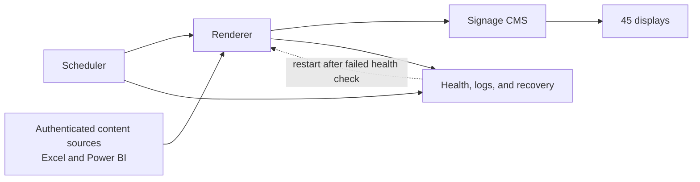

# MagicEmbedBridge: production signage middleware

MagicEmbedBridge is a production Windows and Python service that renders
authenticated Excel and Power BI content for Samsung MagicINFO digital signage.
I designed it, built it, and own it. The service has been live since
August 1, 2026, across 45 displays at a multi-site manufacturer.

It was built as an internal alternative to a SaaS product costing approximately
$70,000 per year. This repository explains the engineering work and operating
model. It does not publish the product source or the details needed to reproduce
the implementation.

## The problem

Operational displays needed current business information, but the source content
required authentication and the signage players were not suitable places for
interactive user sessions. The team also did not have budget for the available
SaaS product.

The middleware had to turn protected business content into images the existing
signage platform could display. It also had to avoid turning a temporary source
failure into a blank or silently frozen screen.

## Constraints

- It had to run on Windows hosts and work with the existing signage system.
- Source-system and signage access had to use least privilege.
- Production installation had to work offline and verify the integrity of every
  release before activation.
- A restart, overlapping scheduler run, bad content, or failed upstream request
  could not corrupt state or publish a broken image.
- Operators needed useful logs, health status, recovery actions, and a fast path
  back to the prior release.
- Delivery could not modify the vendor application's own files.

## Architecture

The scheduler starts a bounded rendering cycle. For each due item, the renderer
uses an application identity to reach the approved content source, waits for the
content to report that it is ready, and captures a display-sized image. It then
updates the corresponding item in the signage CMS. A successful image is retained
as the last known good result.

State is stored outside the application release so schedules, prior results, and
CMS references survive an upgrade or rollback. Structured logs and health data
record both application-wide and per-item outcomes. A separate recovery task
checks the service and restarts it when the health probe fails; a failed recovery
is raised for human attention.

The failure behavior is deliberate. Content that does not finish loading is not
published. The previous successful image remains available, and content that has
been stale beyond its allowed age is visibly marked rather than presented as
current. A lock prevents two scheduler cycles from changing shared state at the
same time. Rendering can be parallelized within a cycle, but the production
default is conservative until real content has been load-tested.

## Deployment and rollback

A release is assembled on a build system with the application, its fixed
dependencies, the browser runtime, operating documents, and integrity hashes.
The complete package can then be carried to the Windows host and installed
without downloading software during the install.

On the host, every release is extracted into its own versioned directory. The
operator verifies the package, prepares the new release alongside the running
one, and runs pre-cutover checks. Shared configuration, state, rendered images,
and logs remain outside version directories. Scheduled work follows a single
active-version pointer, so activation changes the pointer only after the new
version is ready.

Rollback points the service back to the recorded prior version and then repeats
the health checks. The earlier files are kept intact, making rollback a short
switch instead of a reinstall. For the Excel-facing IIS delivery, the same
rollback-safe approach was rolled out across seven plants without modifying the
vendor application tree or restarting IIS.

## Quality evidence

Recorded production and test evidence includes:

- 1,511 successful renderer completions.
- A 649-test middleware suite.
- A separate 46-test deployment-generator suite.
- More than 700 tests across the full delivery and operational validation set.
- A 97% coverage baseline on the primary application.

The tests cover configuration boundaries, authentication, scheduling, locking,
state persistence, browser rendering, signage-system interactions, API behavior,
logging and health reporting, offline release construction, integrity checks,
upgrade, rollback, and recovery wiring. [Testing details](docs/testing.md) describe
the layers without publishing test bodies.

## A production failure and its recovery

An inherited Windows scheduler setting imposed a 72-hour execution limit on the
long-running service. At roughly that boundary, the scheduler stopped the process
and displays stopped receiving fresh content.

The replacement task definition removed the time limit. An independent health
task was also added to probe the service, restart it after repeated failures, and
report when a restart did not restore health. The release acceptance process now
includes a check after 73 hours that the original process is still running and
that rendering has continued. Recovery tasks were validated rather than treated
as complete because they existed on paper.

## What I would do differently

I would define scheduler lifetime and restart behavior before the first production
cutover, then test them across a period longer than every platform default. The
72-hour failure was not in the rendering logic; it came from an inherited runtime
setting that a short acceptance test could not expose.

I would also require evidence from the actual Windows host earlier. Build and unit
tests can prove package structure and application behavior, but they cannot fully
prove host permissions, scheduled-task registration, or restart behavior. Those
checks now belong in the cutover and acceptance record.

Finally, I would load-test representative multi-panel content before selecting a
parallel rendering level. The implementation supports bounded concurrency, but
the safe value depends on the real pages and host resources, not the permitted
configuration range.

## Author and publication boundary

Robert Neal, sole designer and owner.

The product remains private. This public repository contains the case study only
and has no open-source license.
